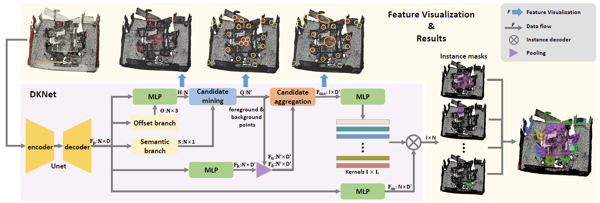
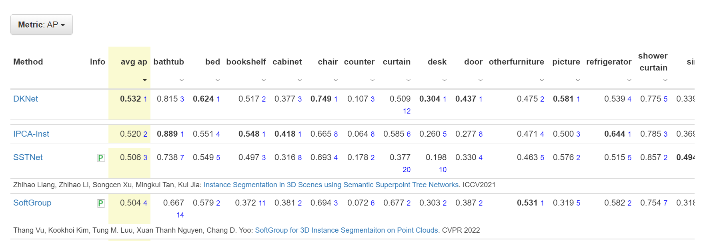

# DKNet (Dynamic Kernel Network)
## 3D Instances as 1D Kernels (ECCV2022)


Code for the paper **3D Instances as 1D Kernels**, ECCV 2022.

**Authors**: Wu Yizheng, Shi Min, Du Shuaiyuan, Lu Hao, Cao Zhiguo, Zhong Weicai

[[paper]](https://arxiv.org/abs/2207.07372)

## Introduction
We introduce a 3D instance representation, termed *instance kernels*, where instances are represented by one-dimensional vectors that encode the semantic, positional, and shape information of 3D instances. We show that instance kernels enable easy mask inference by simply scanning kernels over the entire scenes, avoiding the heavy reliance on proposals or heuristic clustering algorithms in standard 3D instance segmentation pipelines. The idea of instance kernel is inspired by recent success of dynamic convolutions in 2D/3D instance segmentation. However, we find it non-trivial to represent 3D instances due to the disordered and unstructured nature of point cloud data, e.g., poor instance localization can significantly degrade instance representation. To remedy this, we construct a novel 3D instance encoding paradigm. First, potential instance centroids are localized as candidates. Then, a candidate merging scheme is devised to simultaneously aggregate duplicated candidates and collect context around the merged centroids to form the instance kernels. Once instance kernels are available, instance masks can be reconstructed via dynamic convolutions whose weights are conditioned on instance kernels. The whole pipeline is instantiated with a dynamic kernel network (DKNet). Results show that DKNet outperforms the state of the arts on both ScanNetV2 and S3DIS datasets with better instance localization.

## Installation

### Requirements
* Python 3.7.0
* Pytorch 1.5.0
* CUDA 10.2

### Virtual Environment
```bash
conda create -n dknet python==3.7
source activate dknet
```

### Install DKNet

(1) Clone the DKNet repository.
```bash
git clone https://github.com/W1zheng/DKNet.git --recursive
cd DKNet
```

(2) Install the dependent libraries.
```bash
pip install -r requirements.txt
conda install -c bioconda google-sparsehash
```

(3) Install spconv

We use spconv2.x. Please refer to [spconv](https://github.com/traveller59/spconv) for details.

(4) Compile the external C++ and CUDA ops.
* Install dknet_ops
```bash
cd ./lib/dknet_ops
export CPLUS_INCLUDE_PATH={conda_env_path}/dknet/include:$CPLUS_INCLUDE_PATH
python setup.py build_ext develop
```
{conda_env_path} is the location of the created conda environment, e.g., `/anaconda3/envs`.
Alternative installation guide can be found in [here](https://github.com/hustvl/HAIS).

* Install segmentator

Build example:
```bash
cd ./lib/segmentator

cd csrc && mkdir build && cd build

cmake .. \
-DCMAKE_PREFIX_PATH=`python -c 'import torch;print(torch.utils.cmake_prefix_path)'` \
-DPYTHON_INCLUDE_DIR=$(python -c "from distutils.sysconfig import get_python_inc; print(get_python_inc())")  \
-DPYTHON_LIBRARY=$(python -c "import distutils.sysconfig as sysconfig; print(sysconfig.get_config_var('LIBDIR'))") \
-DCMAKE_INSTALL_PREFIX=`python -c 'from distutils.sysconfig import get_python_lib; print(get_python_lib())'`

make && make install # after install, please do not delete this folder (as we only create a symbolic link)
```

Further information can be found in [here](https://github.com/Karbo123/segmentator).

## Data Preparation

(1) Download the [ScanNet](http://www.scan-net.org/) v2 dataset.

(2) Put the data in the corresponding folders.
* Copy the files `[scene_id]_vh_clean_2.ply`,  `[scene_id]_vh_clean_2.labels.ply`,  `[scene_id]_vh_clean_2.0.010000.segs.json`  and `[scene_id].aggregation.json`  into the `dataset/scannetv2/train` and `dataset/scannetv2/val` folders according to the ScanNet v2 train/val [split](https://github.com/ScanNet/ScanNet/tree/master/Tasks/Benchmark).

* Copy the files `[scene_id]_vh_clean_2.ply` into the `dataset/scannetv2/test` folder according to the ScanNet v2 test [split](https://github.com/ScanNet/ScanNet/tree/master/Tasks/Benchmark).

* Put the file `scannetv2-labels.combined.tsv` in the `dataset/scannetv2` folder.

The dataset files are organized as follows.
```
DKNet
├── dataset
│   ├── scannetv2
│   │   ├── train
│   │   │   ├── [scene_id]_vh_clean_2.ply & [scene_id]_vh_clean_2.labels.ply & [scene_id]_vh_clean_2.0.010000.segs.json & [scene_id].aggregation.json
│   │   ├── val
│   │   │   ├── [scene_id]_vh_clean_2.ply & [scene_id]_vh_clean_2.labels.ply & [scene_id]_vh_clean_2.0.010000.segs.json & [scene_id].aggregation.json
│   │   ├── test
│   │   │   ├── [scene_id]_vh_clean_2.ply
│   │   ├── scannetv2-labels.combined.tsv
```

(3) Generate input files `[scene_id]_inst_nostuff.pth` for instance segmentation.
```bash
cd dataset/scannetv2
python prepare_data_inst.py --data_split train
python prepare_data_inst.py --data_split val
python prepare_data_inst.py --data_split test
```

## Training
```bash
CUDA_VISIBLE_DEVICES=0 python train.py --config config/DKNet_run1_scannet.yaml
```
You can start a tensorboard session by
```bash
tensorboard --logdir=./exp --port=6666
```

## Inference and Evaluation

(1) If you want to evaluate on validation set, prepare the `.txt` instance ground-truth files as the following.
```bash
cd dataset/scannetv2
python prepare_data_inst_gttxt.py
```
Make sure that you have prepared the `[scene_id]_inst_nostuff.pth` files before.

(2) Test and evaluate.

a. To evaluate on validation set, set `split` and `eval` in the config file as `val` and `True`. Then run
```bash
CUDA_VISIBLE_DEVICES=0 python test.py --config config/DKNet_run1_scannet.yaml
```
An alternative evaluation method is to set `save_instance` as `True`, and evaluate with the ScanNet official [evaluation script](https://github.com/ScanNet/ScanNet/blob/master/BenchmarkScripts/3d_evaluation/evaluate_semantic_instance.py).

b. To run on test set, set (`split`, `eval`, `save_instance`) as (`test`, `False`, `True`). Then rund
```bash
CUDA_VISIBLE_DEVICES=0 python test.py --config config/DKNet_run1_scannet.yaml
```

c. To test with a pretrained model, run
```bash
CUDA_VISIBLE_DEVICES=0 python test.py --config config/DKNet_run1_scannet.yaml --pretrain $PATH_TO_PRETRAIN_MODEL$
```

We provide a pretrained model trained on ScanNet v2 dataset. Download it [here](https://www.dropbox.com/s/u1twt0akdlj0dy6/checkpoint.pth?dl=0). Its performance on ScanNet v2 validation set is 50.4/66.9/75.9 in terms of mAP/mAP50/mAP25.


## Visualize
To visualize the point cloud, you should first install [mayavi](https://docs.enthought.com/mayavi/mayavi/installation.html). Then you could visualize by running
```bash
cd util
python visualize.py --data_root $DATA_ROOT$ --result_root $RESULT_ROOT$ --room_name $ROOM_NAME$ --room_split $ROOM_SPLIT$ --task $TASK$
```
The visualization task could be `input`, `instance_gt`, `instance_pred`, `semantic_pred`, `semantic_gt`, `candidate` and `candidate_merge`.

## Results on ScanNet Benchmark
Quantitative results on ScanNet test set at the submisison time.



## TODO List
- [ ] Data preparation, training and inference on S3DIS

## Citation
If you find this work useful in your research, please cite:
```
@inproceedings{wu2022dknet,
 author={Yizheng Wu and Min Shi and
        Shuaiyuan Du and Hao Lu and
        Zhiguo Cao and Weicai Zhong},
 booktitle={Proceedings of European Conference on Computer Vision (ECCV)},
 title={3D Instances as 1D Kernels},
 year= {2022}
}
```

## Acknowledgement
This repo is built upon several repos, e.g.,  [spconv](https://github.com/traveller59/spconv), [PointGroup](https://github.com/dvlab-research/PointGroup) and [DyCo3D](https://github.com/aim-uofa/DyCo3D).

## Contact
If you have any questions or suggestions about this repo, please feel free to contact me (yzwu21@hust.edu.cn).
